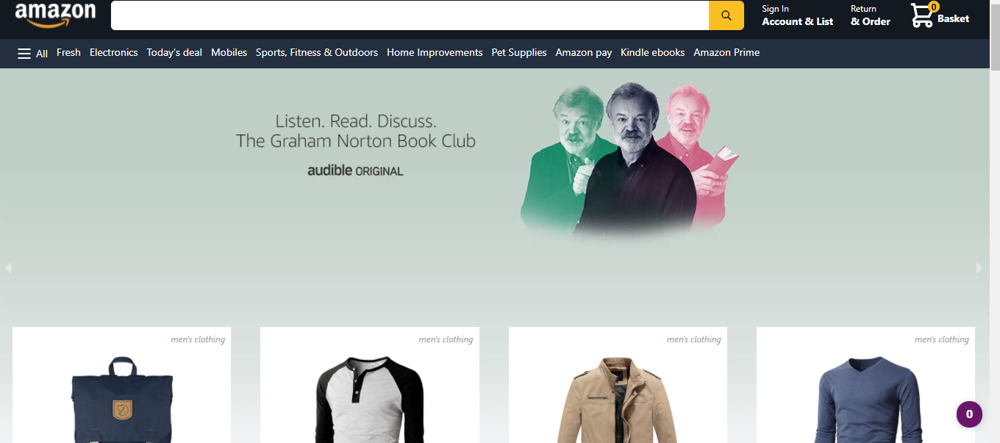
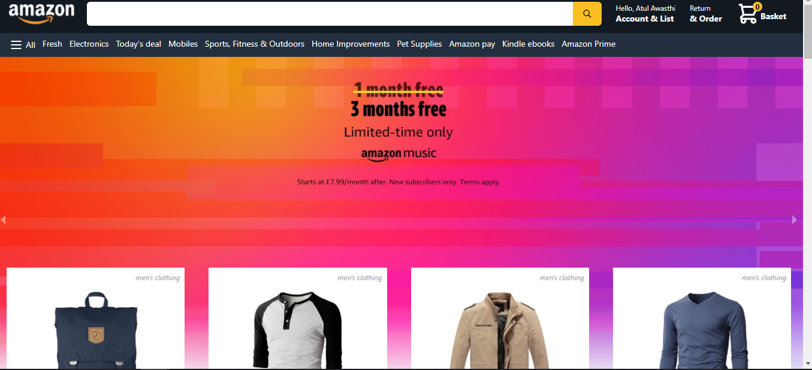
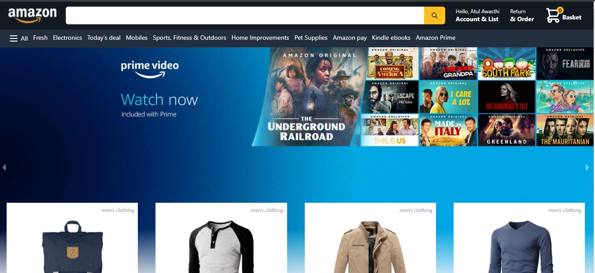
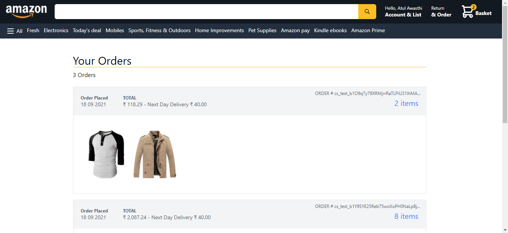

Building an e-commerce webapp using React.js, Next.js. Tailwind CSS
This project contains authentication, routing, API, redux, Stripe
for payment integration.
Users can choose products and add/remove items in the basket


## [Live link](https://ecommerce-webapp-483i0p9fb-kumaratul60.vercel.app)

### Snapshots of project 👇 











# Installation Steps


## Using npm

Run commands

1) ```npm install```


2) ```npm run dev```


## Or using yarn

Run commands 

1) ```npm install --global yarn```

2) ```yarn install```

3) ```yarn run dev```


### If you see the window below then you are set to build AMAZON 2.0!


